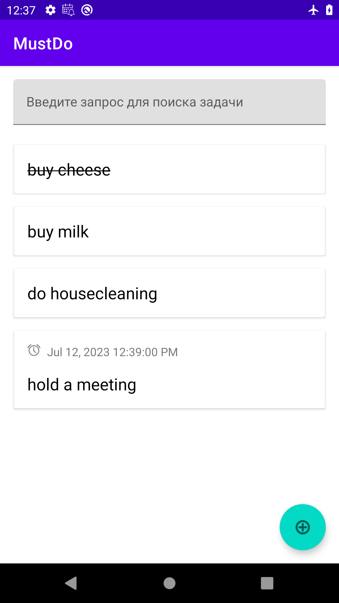
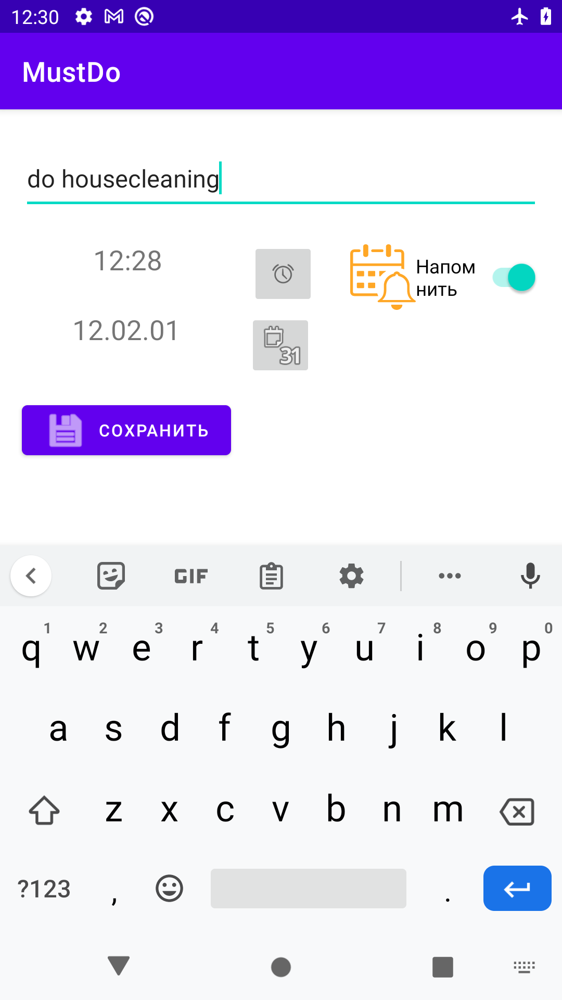
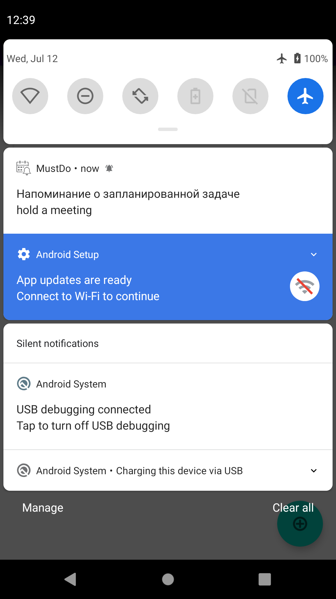

A simple application for organizing tasks. 
The application can:
1. adding, editing tasks
1. task search
1. the ability to set a reminder at a certain time. The reminder is displayed as a pop-up notification.

Technologies used in the project:
* Android Jetpack Components
* Dagger2
* Room
* Navigation
* viewBinding
* Coroutines/Flows
* Clean architecture, MVVM

